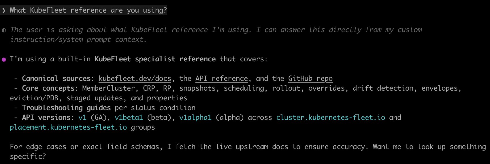

# KubeFleet agent prompts

Reference knowledge for [KubeFleet](https://kubefleet.dev/) — multi-cluster Kubernetes management via hub-and-spoke placement, scheduling, staged rollouts, overrides, drift detection, and eviction.

Covers concepts, how-tos, API groups/versions, troubleshooting conditions, and CLI quick-reference. Grounded in the official docs at https://kubefleet.dev/docs, with inline `Full docs: <url>` links under every section so the agent can fetch upstream when it needs more detail.

## Files

| File | Target tool | Format |
|------|-------------|--------|
| `claude.md` | Claude Code | Markdown with YAML frontmatter (`name`, `description`, `model`, `tools`) |
| `codex.md` | OpenAI Codex | Plain markdown (no frontmatter) |
| `copilot.md` | GitHub Copilot | Plain markdown (no frontmatter) |

The three files share the same body — only the frontmatter differs so each tool can parse it.

---

## Install

### Claude Code

Drop the file into your agents directory — user-level (available in every session) or project-level (this repo only):

```bash
# User-level (recommended — reusable across all projects)
mkdir -p ~/.claude/agents
curl -fsSL https://raw.githubusercontent.com/ytimocin/agents/main/kubefleet/claude.md \
  -o ~/.claude/agents/kubefleet-specialist.md

# Project-level
mkdir -p .claude/agents
curl -fsSL https://raw.githubusercontent.com/ytimocin/agents/main/kubefleet/claude.md \
  -o .claude/agents/kubefleet-specialist.md
```

The frontmatter registers it as a subagent named `kubefleet-specialist`. Invoke it by asking Claude Code to "use the kubefleet-specialist agent", or delegate programmatically via the `Agent` tool with `subagent_type: "kubefleet-specialist"`.

---

### OpenAI Codex

**1. Install Codex CLI** and authenticate (`codex login` or set `OPENAI_API_KEY`):

```bash
brew install codex            # or: npm install -g @openai/codex
codex --version
```

**2. Drop the prompt into Codex's instruction path.** Two options — pick based on scope:

```bash
# Global — active in every Codex session
mkdir -p ~/.codex
curl -fsSL https://raw.githubusercontent.com/ytimocin/agents/main/kubefleet/codex.md \
  -o ~/.codex/AGENTS.md

# Per-project — scoped to the current directory
curl -fsSL https://raw.githubusercontent.com/ytimocin/agents/main/kubefleet/codex.md \
  -o AGENTS.md
```

Codex merges `AGENTS.md` files up the directory tree — either works. Run `codex` in your target directory; the startup banner lists the loaded path next to `Agents.md:` so you can confirm it's picked up.

---

### GitHub Copilot CLI

The standalone terminal tool. For VS Code or other IDEs, drop the same file at `.github/copilot-instructions.md` per repository and enable **GitHub › Copilot › Chat › Code Generation: Use Instruction Files** in settings.

**1. Install and authenticate:**

```bash
npm install -g @github/copilot
copilot       # first launch walks through GitHub sign-in
```

Requires a Copilot subscription. Run `copilot --help` if command names differ — this CLI moves fast.

**2. Install the prompt into a workspace.** Copilot CLI reads `.github/copilot-instructions.md` from the directory it's launched in:

```bash
mkdir -p .github
curl -fsSL https://raw.githubusercontent.com/ytimocin/agents/main/kubefleet/copilot.md \
  -o .github/copilot-instructions.md
```

For an always-on personal setup (active in every directory), check `copilot --help` for the user-level custom-instructions path — last checked it lives under `~/.copilot/`.

**3. Launch** with `copilot` in the workspace. When it's loaded correctly, asking *"What KubeFleet reference are you using?"* produces a reply that cites `kubefleet.dev/docs` and the section structure from the file:



---

## Updating

These files track the live KubeFleet docs. To refresh, re-run the relevant `curl` above — nothing else is needed.

## Provenance and scope

- Built from the public docs at https://kubefleet.dev/docs and the repo at https://github.com/kubefleet-dev/kubefleet.
- Intended as a fast-retrieval reference for an LLM, not a substitute for the upstream docs. When in doubt, link the user to the canonical page.
- Claims not directly stated in the docs are explicitly hedged in-text.
